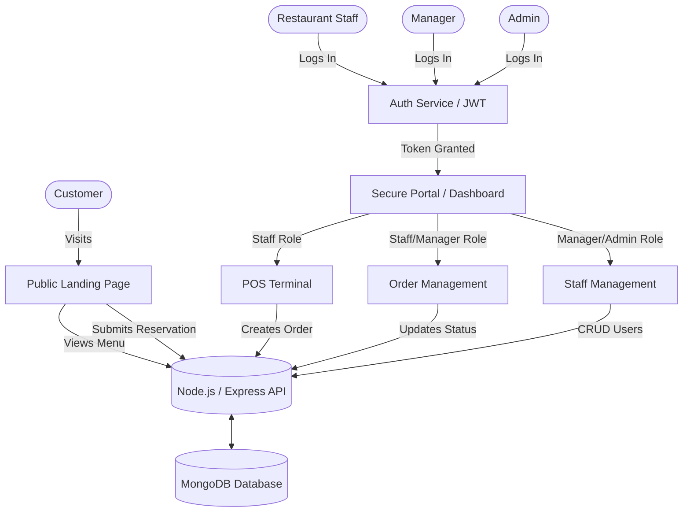
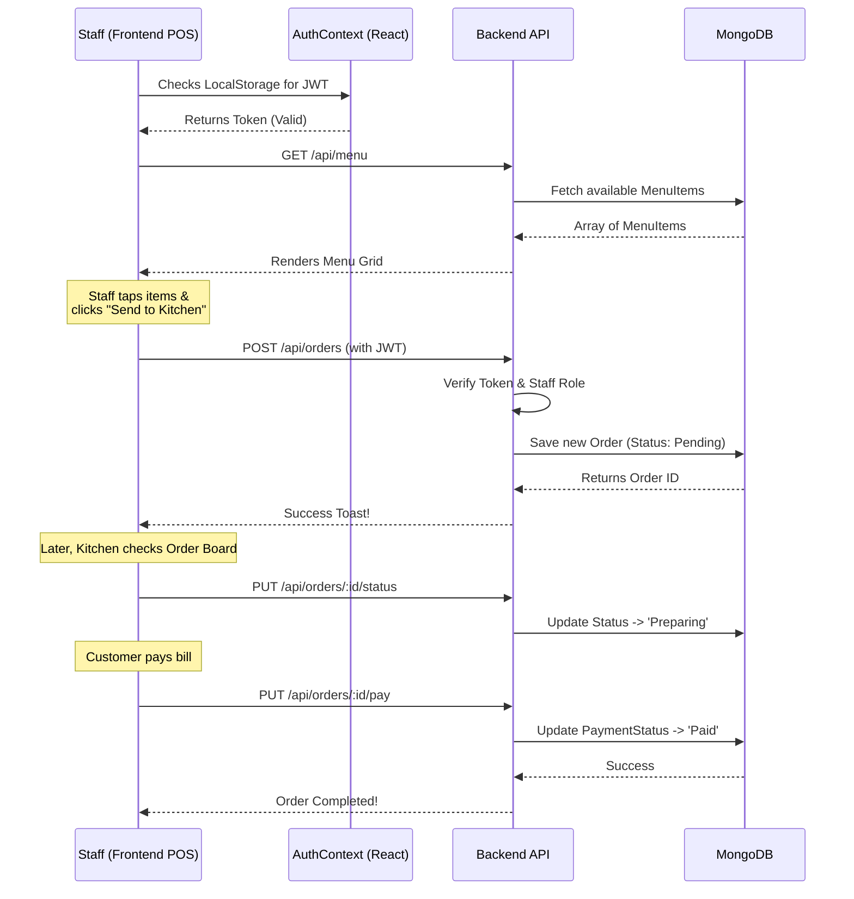

# 🏔️ Annapurna Kitchen Management System

A comprehensive, full-stack web application designed for a modern Nepali restaurant. It features a beautiful, public-facing landing page for customers and a secure, role-based Point of Sale (POS) and Management Portal for restaurant staff.

---

## ✨ System Features

### 🌍 Public Landing Page
*   **Immersive UI/UX:** Parallax hero section, floating particles, and a dark/moody aesthetic with deep crimsons and saffron gold accents.
*   **Dynamic Menu:** Categorized, tab-filtered menu that fetches live data from the MongoDB backend.
*   **Customer Interactions:** Functional reservation forms and newsletter signups that post directly to the backend API and send automated confirmation emails via Nodemailer.
*   **Responsive:** Fully mobile-responsive utilizing Vite and React 18.

### 🛡️ Secure Staff Portal (POS)
*   **Role-Based Access Control (RBAC):** Strict JWT-based authentication separating `admin`, `manager`, and `staff` permissions.
*   **Graphical POS Terminal:** A tablet-optimized Point of Sale interface where staff can tap menu items to add them to a dynamic ticket/cart.
*   **Order Management Board:** A Kanban-style view for kitchen staff and managers to track orders from *Pending* → *Preparing* → *Completed*, and process payments.
*   **Staff Management:** Dedicated admin area for creating and deactivating employee accounts.

---

## 🛠️ Technology Stack

**Frontend Architecture (React + Vite)**
*   **Routing:** `react-router-dom` (separating `/` public routes and `/portal/*` secure routes)
*   **State Management:** React Context API (`AuthContext`)
*   **Styling & Animation:** Vanilla CSS Variables, Framer Motion
*   **Icons:** Lucide React

**Backend Architecture (Node.js + Express)**
*   **Database:** MongoDB & Mongoose
*   **Authentication:** JSON Web Tokens (JWT), `bcryptjs`
*   **Security:** Helmet, CORS, Express-Rate-Limit, Express-Validator
*   **Emails:** Nodemailer

---

## 📊 Architecture & Workflow

The following diagram illustrates the high-level architecture and Role-Based Access Control (RBAC) workflow of the system:



---

## 🔄 Order Lifecycle (Sequence Diagram)

The following sequence diagram details the flow of data when a staff member takes an order and processes it through the POS portal:



---

## 🚀 Local Development Setup

### 1. Database & Backend Setup
1. Open a terminal and navigate to the `backend` folder:
   ```bash
   cd backend
   npm install
   ```
2. Configure Environment Variables:
   Create a `.env` file in the `backend` folder and add:
   ```env
   NODE_ENV=development
   PORT=5000
   MONGODB_URI=mongodb://localhost:27017/annapurna_kitchen
   JWT_SECRET=your_super_secret_key_123
   ```
3. **Seed the Database:** Run this command to generate your first Admin user and populate the Menu items from the static frontend file:
   ```bash
   npm run seed
   npm run seed:menu
   ```
4. Start the backend server:
   ```bash
   npm run dev
   ```

### 2. Frontend Setup
1. Open a *new* terminal and navigate to the `frontend` folder:
   ```bash
   cd frontend
   npm install
   ```
2. Start the Vite development server:
   ```bash
   npm run dev
   ```
3. The public site is now running at `http://localhost:5173`.
4. Access the POS Portal at `http://localhost:5173/portal` and log in with the seeded credentials:
   * **Email:** `admin@annapurnakitchen.com`
   * **Password:** `password123`
