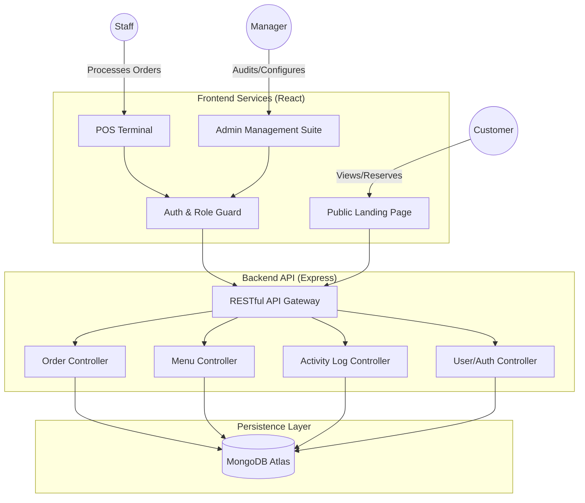
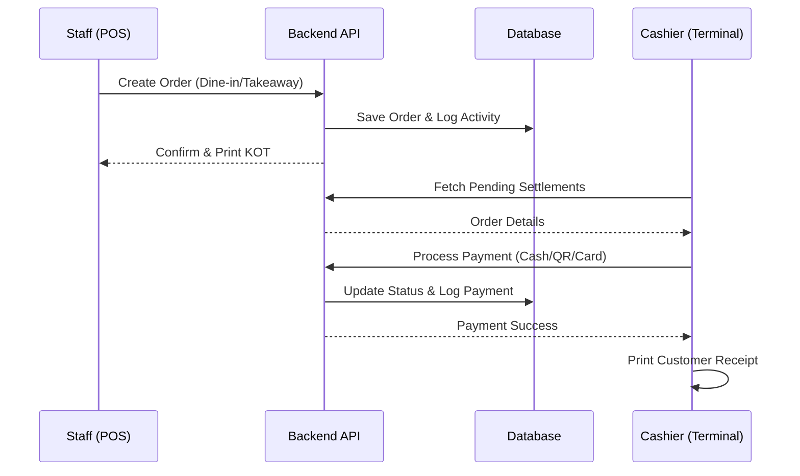

# 🏔️ Annapurna Kitchen | Enterprise POS & Management Suite

[](https://reactjs.org/)
[](https://nodejs.org/)
[](https://www.mongodb.com/)
[](LICENSE)

Annapurna Kitchen is a state-of-the-art, full-stack restaurant management platform. It transforms a simple landing page into a robust operational hub, featuring a high-performance POS terminal, real-time financial tracking, and comprehensive staff oversight.

---

## 🚀 Key Modules & Features

### 🏢 Admin & Management Portal
*   **Operational Dashboard:** Real-time KPI tracking (Revenue, Order volume, Table occupancy) with live activity feeds.
*   **Menu Engineering:** Full CRUD interface for menu items with bilingual support, stock management, and instant availability toggling.
*   **Cashier Terminal:** Professional settlement hub with dynamic QR code generation, manual payment processing (Cash/Card), and tax-compliant receipt printing.
*   **Staff Activity Audit:** A comprehensive, non-repudiable log of every staff action, ensuring full operational accountability.
*   **Table & Reservation Management:** Dynamic floorplan control and real-time reservation tracking.

### 📱 Graphical POS Terminal
*   **Tablet-Optimized Interface:** High-velocity ordering system with category filtering and smart search.
*   **Order Customization:** Add specific notes and modifiers to individual items.
*   **Customer Loyalty:** Integrated customer lookup with automatic discount application based on visit history.

### 🏠 Public Landing Page
*   **Dynamic Menu:** Automatically syncs with the Management Portal to show real-time availability and pricing.
*   **Live Reservations:** Seamless booking system with automated confirmation.
*   **Responsive Design:** Premium, "Deep Space" themed UI optimized for all devices.

---

## 📊 System Architecture



---

## 🛠️ Technology Stack

| Layer | Technologies |
| :--- | :--- |
| **Frontend** | React 18, Vite, Framer Motion (Animations), Lucide (Icons) |
| **Backend** | Node.js, Express.js |
| **Database** | MongoDB, Mongoose (ODM) |
| **Security** | JWT, BcryptJS, Helmet, CORS, Rate-Limiting |
| **Utilities** | Nodemailer, Express-Validator |

---

## 🏗️ Data Flow (Order-to-Settle)



---

## ⚙️ Installation & Setup

### Prerequisites
*   Node.js (v16+)
*   MongoDB Atlas account or local MongoDB instance

### 1. Clone & Install
```bash
git clone https://github.com/rautbibek123/Annapurna-Kitchen_Restaurant.git
cd Annapurna-Kitchen_Restaurant
```

### 2. Environment Configuration
Create a `.env` file in the `backend/` directory:
```env
PORT=5000
MONGO_URI=your_mongodb_connection_string
JWT_SECRET=your_super_secret_key
JWT_EXPIRE=30d
NODE_ENV=development
```

### 3. Run Development Servers
**Backend:**
```bash
cd backend
npm install
npm run dev
```

**Frontend:**
```bash
cd frontend
npm install
npm run dev
```

---

## 🔐 Security & Access Control
The system implements strict **Role-Based Access Control (RBAC)**:
*   **Admin:** Full system access, including financial settings and staff management.
*   **Manager:** Menu management, activity logs, and order oversight.
*   **Staff/Cashier:** POS operations, basic order processing, and payment settlement.

---

## 📜 License
This project is licensed under the MIT License - see the [LICENSE](LICENSE) file for details.

---

## 👨‍💻 Author
**Bibek Raut** - [GitHub Profile](https://github.com/rautbibek123)

---
*Created with ❤️ for Annapurna Kitchen Restaurant.*
